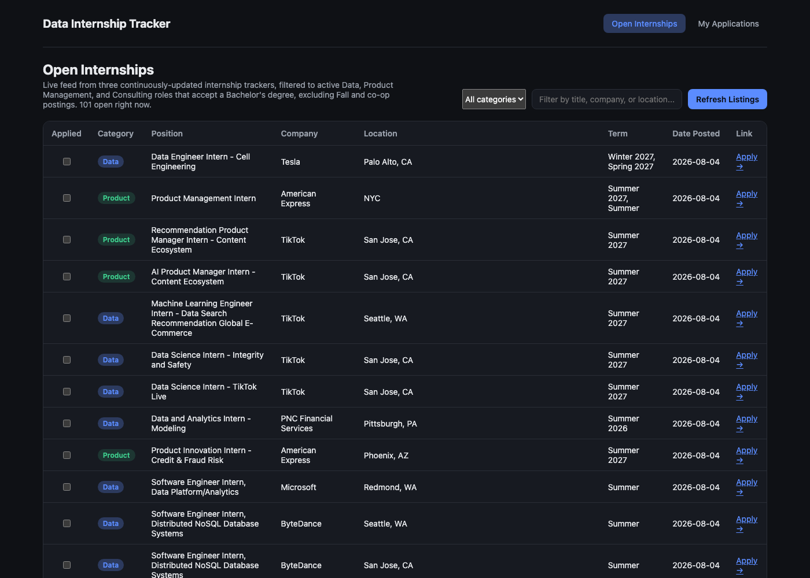
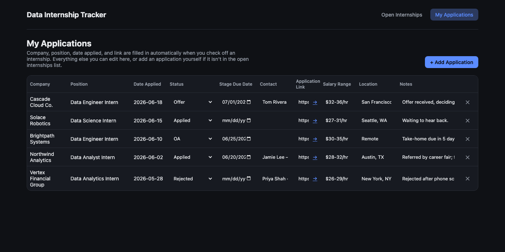

# Data Internship Tracker

A full-stack tracker for internships in Data & AI, Product, Consulting, and Technology roles. It pulls live
listings from public internship-tracking feeds, filters them down to roles that actually match
what you're looking for, and lets you check off the ones you've applied to — auto-filling most of
the application record for you.

**Live demo (Open Internships feed only, read-only):** [HERE](https://job-tracker-xi-gray.vercel.app)

The application tracker is personal, so it isn't part of the public demo — clone the repo to run
the full app, including your own tracked applications.

## Screenshots

**Open Internships** — the live, filterable feed:



**My Applications** — your tracked applications, with an editable status dropdown:



## Features

### Open Internships (`/`)

- Only shows postings that:
  - are currently **active**
  - have **"Intern"** in the title (filters out full-time/grad-assistant roles some sources mix in)
  - **accept a Bachelor's degree** (excludes listings explicitly requiring an advanced degree only)
  - aren't **Fall/Co-op only** terms
- Server-side cache (15 min) to avoid hammering the upstream feeds; a "Refresh Listings" button
  forces a re-fetch.
- Filter by category, or search by title/company/location.
- Check the box next to a listing to mark it applied — this creates a matching row on the
  Applications page automatically (company, position, date applied, and link pre-filled).

### My Applications (`/applications`)

- Every internship you've applied to, one row per application.
- **Auto-filled** when added from the Open Internships page: Company, Position, Date Applied,
  Application Link.
- **Editable** on every row:
  - **Status** — dropdown: Applied, OA, Phone Screen, First Round Interview, Second Round
    Interview, Final Round Interview, Offer, Rejected, Withdrawn
  - Stage Due Date, Contact, Application Link, Salary Range, Location, Notes
- "+ Add Application" to manually track one that isn't in the Open Internships feed.
- Remove a row to un-track an application.

## Stack

- `server/`: Node.js + Express API, [`better-sqlite3`](https://github.com/WiseLibs/better-sqlite3)
  for local persistent storage (WAL mode)
- `client/`: React + Vite frontend

```
job-tracker/
├── server/
│   ├── index.js         # Express routes (jobs, applications CRUD)
│   ├── jobsService.js    # Fetches, merges, dedupes, and filters listings from all sources
│   ├── db.js              # SQLite connection + schema
│   └── data/              # SQLite database file (gitignored)
└── client/
    └── src/
        ├── pages/JobBoard.jsx      # Open Internships page
        ├── pages/Applications.jsx  # My Applications page
        └── api.js                 # Fetch wrappers for the API
```

## Run it

```bash
npm install --prefix server
npm install --prefix client
npm run dev
```

This starts the API on http://localhost:4000 and the frontend on http://localhost:5173 (Vite
proxies `/api` to the backend). Data is stored locally in `server/data/jobtracker.db`.

## API

| Method | Route | Description |
| --- | --- | --- |
| GET | `/api/jobs` | Current filtered/deduped internship listings. `?refresh=true` bypasses the cache. |
| GET | `/api/applications` | All tracked applications. |
| POST | `/api/applications` | Create an application (from the job board checkbox, or manually). |
| PATCH | `/api/applications/:id` | Update editable fields (status, dates, contact, notes, etc.). |
| DELETE | `/api/applications/:id` | Remove an application. |
| GET | `/api/status-options` | The list of valid status dropdown values. |
